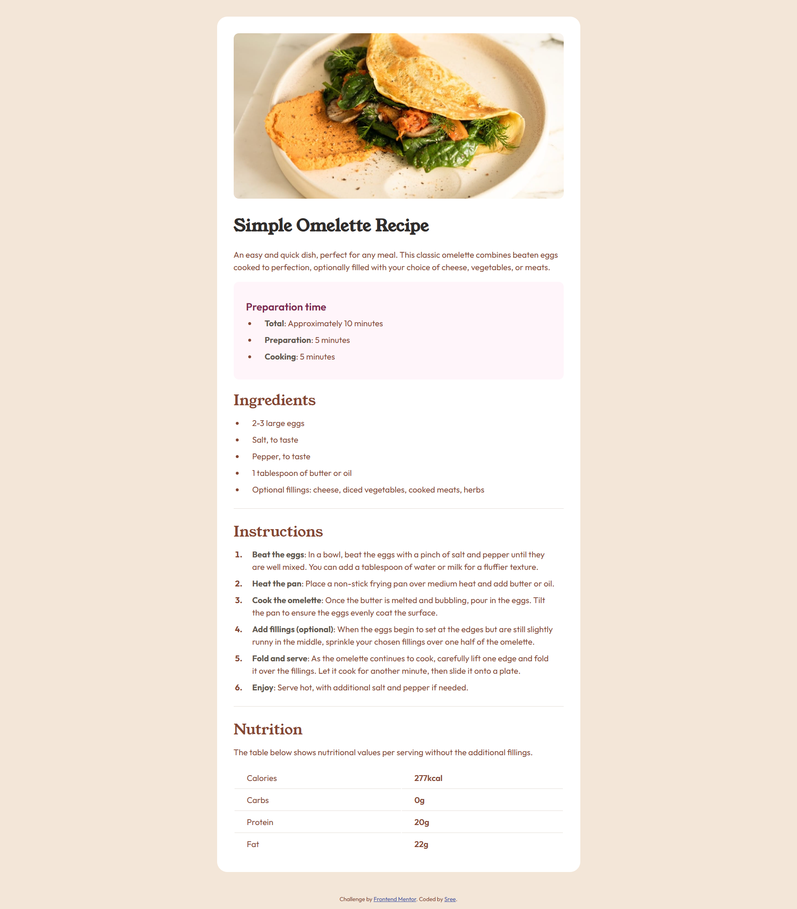

# Frontend Mentor - Recipe Page Solution

This is my solution to the [Recipe Page challenge on Frontend Mentor](https://www.frontendmentor.io/challenges/recipe-page-KiTsR8QQKm). This challenge helped me practice responsive design, semantic HTML, and clean CSS structure while building a simple, beautiful recipe card.

## Table of contents

- [Overview](#overview)
  - [Screenshot](#screenshot)
  - [Links](#links)
- [My Process](#my-process)
  - [Built With](#built-with)
  - [What I Learned](#what-i-learned)
  - [Continued Development](#continued-development)
  - [Useful Resources](#useful-resources)
- [Author](#author)

---

## Overview

### Screenshot



### Links

- 🔗 [Solution on Frontend Mentor](https://www.frontendmentor.io/solutions/)  
- 🌐 [Live Site URL](https://your-live-site-url.com)

---

## My Process

### Built With

- Semantic HTML5  
- CSS Custom Properties  
- Flexbox  
- Mobile-first responsive layout  
- Google Fonts (Outfit & Young Serif)

### What I Learned

- How to structure a clean, responsive card layout with semantic HTML.  
- How subtle styling issues (like line-height/margin collapse) can appear due to browser zoom levels.  
- Using `::marker` to customize bullet and number styles cleanly:

```css
ol li::marker,
ul li::marker {
  font-weight: bold;
  color: hsl(14, 45%, 36%);
}
```
- Importance of consistency in spacing/padding across screen sizes:

```
.recipe-container {
  padding: 1rem;
}

@media screen and (min-width: 768px) {
  .recipe-container {
    padding: 2rem;
  }
}
```

### Continued Development

- Explore utility-first frameworks like **Tailwind CSS** for faster prototyping and consistent styling.
- Focus more on **accessibility**, including proper `aria-*` attributes and color contrast checks.
- Improve mobile responsiveness by experimenting with **CSS Grid** for more complex layouts.
- Add **transitions/animations** for visual polish using `transition`, `transform`, and `:hover` states.

### Useful Resources

- [CSS Tricks: Understanding the Box Model](https://css-tricks.com/the-css-box-model/) – Helped solidify my understanding of spacing and layout behavior.
- [MDN Web Docs: Styling Lists](https://developer.mozilla.org/en-US/docs/Web/CSS/::marker) – Helped me learn how to style list bullets and numbers with `::marker`.
- [Frontend Mentor Discord](https://discord.gg/frontendmentor) – A great place for feedback, tips, and learning from others.

---

## Author

- GitHub - [@Imissh3r](https://github.com/Imissh3r)  
- Frontend Mentor - [@Imissh3r](https://www.frontendmentor.io/profile/Imissh3r)
